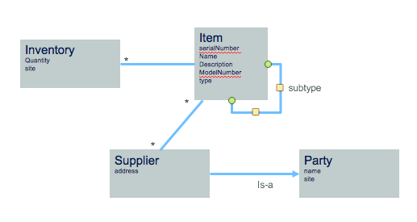

# Inventory Data Access Layer
This project is part of the 'IBM Hybrid Integration Reference Architecture' solution, available at [https://github.com/ibm-cloud-architecture/refarch-integration](https://github.com/ibm-cloud-architecture/refarch-integration).

Updated 11/27/2017.

The goal of this project is to implement a set of SOA services to manage inventory, supplier and stock per site. This is on purpose that we centralize those three components inside the same application to represent an older application design done in the 2000s.
In 2017, most likely, we will have separated those three entities into three micro services.

## Table of Contents
* [Goals](https://github.com/ibm-cloud-architecture/refarch-integration-inventory-dal#goals)
* [Technology](#technology)
* [Code explanation](#code-explanation)
* [Build and deploy](#build-and-deploy)
* [Install on IBM Cloud Private](docs/icp/README.md)
* [TDD](#test-driven-development)

## Goals
The goal of this project is to define a SOAP interface for the Inventory datasource and implement the data access object as JPA entities. The operations are visible in the wsdl saved [here](docs/ws.wsdl). This wsdl is used for documentation purpose but it can also be imported in API Connect or IBM Integration Bus for interface mapping. The WSDL can be visible by using a web browser to the following URL:
* when deploy on premise liberty server: http://172.16.254.44:9080/inventory/ws?WSDL
* when deploy on ICP, you need to have a name resolution for the dal.brown.case then the URL is http://dal.brown.case/inventory/ws?WSDL


## Technology
The application is packaged as a war file to be deployed to a lightweight server like [IBM WebSphere Liberty profile](https://developer.ibm.com/wasdev/downloads/download-latest-stable-websphere-liberty-runtime).
The code uses JPA 2.0 and JAXWS 2.2 APIs (See [JAXWS summary note](docs/jaxws.md)).

The server configuration defines the features needed and the datasource configuration. To get understanding on our server configuration see the explanation [here](docs/liberty-server.md).

The data model is simple as illustrated below:  



* Item is the main product description and may include sub components.
* The Inventory specifies how many items are in a given site
* A Supplier delivers items and is-a Party.

## Code Explanation
The source code is organized to follow maven and gradle conventions: src/main/java or src/test/java...

The SOAP service is defined in the class inventory.ws.DALService and uses [JAXWS](docs/jaxws.md) annotations to define the service and the operations.
```
@WebService
public class DALService {
  ...

  @WebMethod(operationName="items")
	public Collection<Item> getItems() throws DALException {
```
The Item and Supplier classes are [Data Transfer Object Pattern](https://martinfowler.com/eaaCatalog/dataTransferObject.html) classes to deliver a simple view of the entities persisted in the database and not expose all the attributes persisted in the DB.

For information about the DB2 Inventory schema refer to the [Database github repository](https://github.com/ibm-cloud-architecture/refarch-integration-inventory-db2)

The Item from the data base table ITEMS was mapped to the inventory.model.ItemEntity class which uses a set of JPA annotations to map to the DB2 tables.

```
Entity(name="Item")
@Table(name="ITEMS")
@NamedQuery(name="Item.findAll", query="SELECT i FROM Item i")
public class ItemEntity implements Serializable {
  ...
  @Id
  @GeneratedValue (strategy=GenerationType.SEQUENCE)
  @Column(nullable=false)
  protected long id;

  @Column(nullable=false, length=1500)
  private String description;
  @Column(nullable=false, length=100)
  protected String name;
  @Column(precision=8, scale=2)
  private double price;
  @Column(length=100)
  private String img;
  @Column(name="IMG_ALT", length=75)
  private String imgAlt;
  @Column(precision=5)
  private int quantity;
  private Timestamp updateDate;
  private Timestamp creationDate;

```
The same approach is done for the Inventory and the Supplier table. Inventory is not expose to the SOAP service.

The unit tests are using an embedded derby to validate the service and data access object layer without dependency to external DB. In production the data base is DB2.
Therefore two persistence.xml are defined: one for testing ( src/test/resources) and one for production to be packaged into the war (src/java/resources).

# Build and deploy
## Preparing the project
The project was developed with [Eclipse Neon](http://www.eclipse.org/neon) with the following plugins added to the base eclipse:
* Websphere Developer Tool for Liberty: using the Marketplace and searching WebSphere developer, then use the Eclipse way to install stuff.
* Gradle eclipse plugin

Install gradle CLI on your computer so you can build, unit test and assemble war.  For that see the installation instructions at [gradle](http://gradle.org)

## Preparing your App server
You can use two approaches: install everything on your computer or use our docker file we have defined in this project.
### Install everything
* Install Java JDK, preferably Oracle one. For example for a Ubuntu build server we did the following commands
```
$ sudo update-ca-certificates -f
$ sudo add-apt-repository ppa:webupd8team/java
$ sudo apt-get update
$ sudo apt-get install oracle-java8-installer
$ sudo apt-get install oracle-java8-set-default
```

* Install the WebSphere Liberty profile by downloading it from [WAS dev](https://developer.ibm.com/wasdev/downloads/download-latest-stable-websphere-liberty-runtime). See our configuration explanations [here](docs/liberty-server.md).

### Docker
Once you build the code with `gradlew build` (see next section) you can build a docker image that will include JDK, WebSphere Liberty, the good server configuration and the deployed war.
```
# Execute only when there is a new image
$ docker build -t ibmcase/dal .
# Start the container
$ docker run -p 9080:9080 ibmcase/dal
```

From this docker image it will be easy to [deploy to IBM Cloud Private](docs/icp/README.md)
## Build
The build is supported by `gradlew`. The project folder has a gradle wrapper so running
```
> ./gradlew build
```
should compile, unit tests and build a war under build/libs
Here is an example of execution trace
```
Starting a Gradle Daemon (subsequent builds will be faster)
:compileJava
:openjpaEnhance
36  inventory  INFO   [Daemon worker] openjpa.Tool - Enhancer running on type "class inventory.model.ItemEntity".
:processResources UP-TO-DATE
:classes
:war
:assemble
:compileTestJava
:processTestResources UP-TO-DATE
:testClasses
:test
```

We also propose to leverage a build server and do continuous integration and deployment, see detail in [this note.](docs/cicd.md) about it.

## Test Driven development
The service and data access object classes were developed by starting by the tests. The first test to validate the access to data and to validate CRUD operation happy path. The tests use the service API of the DALService classes. Here is an example of tests:
```
public class TestInventoryDB {

	static DALService serv;

	@BeforeClass
	public static void setUpBeforeClass() throws Exception {
		 serv = new DALService();
	}
  ....
  @Test
	public void testLoadAllItems() {
		Collection<Item> items =null;
		try {
			items = serv.getItems();
		} catch (DALException e) {
			e.printStackTrace();
			fail("Exception");
		}
		Assert.assertNotNull(items);
		Assert.assertTrue(items.size() >= 1);
	}
```
The tests are using a Derby embedded database so it is easier to start and execute tests in isolation. The AfterClass method is deleting the locally created `INVDB` instance. See the `BaseTest` class.

When tests are executed by `gradlew` the reports are in the build/reports folder.

## Deploy
The script ./deployToWlp.sh copy the created war to your local wlp, modify the path in this script to reflect your local environment if you do not have your WebSphere Liberty profile under ~/IBM/wlp.
The server name was *appServer*.

You do not need that if you use docker.
To deploy to IBM Cloud Private [this note](docs/icp/README.md) will go in detail.

## Access deployed wsdl
Using a web broswer to the localhost should display the wsdl: [http://localhost:9080/inventory/ws?wsdl](http://localhost:9080/inventory/ws?wsdl)

# Conclusion
The SOA service operations defines in this project are not exposed to Bluemix application or microservices directly. Most likely a integration bus gateway flow will expose interfaces in the necessary different format.
The project  [Inventory Flow - Integration Bus](https://github.com/ibm-cloud-architecture/refarch-integration-esb) provides the implementation of this mapping flow.

Also we define an `Inventory` API product in IBM API Connect. See project [API](https://github.com/ibm-cloud-architecture/refarch-integration-api).

# Contribute
We welcome contribution. Contribution is not only PRs and code, but any help with docs or helping other developers to solve issues are very appreciated! Thanks in advance!

To standardize on contribution guidance see [main brown compute repository](https://github.com/ibm-cloud-architecture/refarch-integration).
