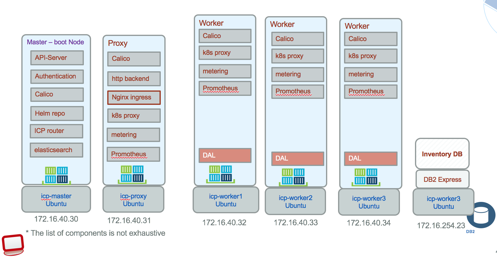
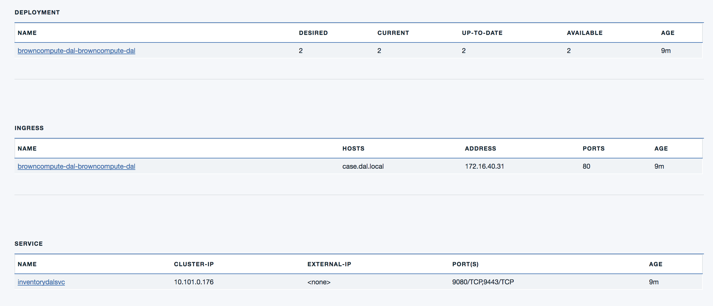

# Deploy the Data Access Layer to IBM Cloud Private

Updated 11/30/2017.

There are two ways to deploy the Data Access layer component:
1. deploy the Webpshere Liberty chart to ICP using ICP Catalog and then deploy the application on the Liberty server: this is the classical concept of operation used on JEE application server.
1. dockerize the app with its own liberty image and deploy it to ICP

We start by documenting the second approach by packaging the code as a docker image, build a helm chart and then publish it to an ICP cluster.

The ICP topology looks like the image below:


The data access layer is accessing the DB2 running on premise using the JDBC protocol, and is exposed to the external world via Ingress rules so a SOAP request to the URL http://dal.brown.case/inventory/ws will return item(s) from the database.

## Tutorial
For deploying this application the following steps are done:
1. [Build Docker Image](#build)
1. [Define Helm configuration](#build-the-helm-package)
1. [Deploy to ICP](#deploy-the-helm-package)
1. [Validate](#validation)

### Pre-requisites
* Have an instance of ICP up and running.
* The DAL code is running on WAS Liberty on premise server connected to the DB

If you did not configure your ICP environment with SSH certificates, ... please read [this note](https://github.com/ibm-cloud-architecture/refarch-integration/blob/master/docs/icp-deploy.md#common-installation-tasks)

## Build
This project includes a docker file to build a docker image. It uses the public liberty image from public docker hub, and then copy the code and configuration for Liberty server to the image.
```
FROM websphere-liberty:webProfile7
```

You can build the image to your local repository using the following commands:
```
# first compile and build the App war file
$ gradlew build
# build the image
$ docker build -t ibmcase/dal .
$ docker images
#... should see ibmcase/dal image
```

You can run the application from the container to verify it works fine.
```
$ docker run -d -p 9080:9080 --name idal -rm ibmcase/dal
# then point your webbrowser to http://localhost:9080/inventory/ws?wsdl to see the WSDL of the SOA service.
$
```

Then tag your local image with the name of the remote server where the docker registry resides, and the namespace to use. (*master.cfc:8500* is the remote server and *browncompute* is the namespace used). Increase the version number overtime for major deployment.

```
$ docker tag ibmcase/dal master.cfc:8500/browncompute/dal:v0.0.1
$ docker images
# you should get something like:
REPOSITORY                        TAG                 IMAGE ID            CREATED              SIZE
master.cfc:8500/browncompute/dal   v0.0.1             906ad6fc851e        About a minute ago   474MB
ibmcase/dal                          latest           906ad6fc851e        About a minute ago   474MB
websphere-liberty                 webProfile7         905fc63e8e9b        
```

### Push docker image to ICP private docker repository
Be sure to have the **master.cfc:8500** hostname mapped to the IP address of the ICP master node. (Use /etc/hosts or update the DNS server settings)

```
docker login master.cfc:8500
User: admin
```
Push the image newly created:
```
docker push master.cfc:8500/brown/dal:v0.0.1
```

## Build the helm package

The `browncompute-dal` chart was already created with the 'helm create browncompute-dal' command. This commands create the chart.yaml, values.yaml and a set of template files. We will not cover again the details of those files, you can read [this note](https://github.com/ibm-cloud-architecture/refarch-caseinc-app/blob/master/docs/run-icp.md#build-the-helm-package) for more information.

### Chart.yaml
Set the version and name for the chart release. This name will be visible in ICP in the **Workloads > Helm releases** menu of the admin console.
This name is used in deployment and service definition. Each time you deploy a new version of your app you can just change the version number. The values in the chart.yaml are used in the templates.
```yaml
apiVersion: v1
description: A Helm chart to run Brown Compute Data Access Layer on Kubernetes
name: browncompute-dal
version: 0.0.1
```
The name of the chart needs to map the name of the parent folder. (It was created by `helm create` command so no problem...normally)

The `templates/deployment.yaml` is not modified.

### values
Specify in this file the docker image name and tags.

```yaml
image:
  repository: master.cfc:8500/brown/dal
  tag: v0.0.1
  pullPolicy: IfNotPresent
```

Try to align the number of helm package with docker image tag.
Add the two port numbers for the HTTP and HTTPS that were exposed in the dockerfile:

```yaml
service:
  name: inventorydalsvc
  type: ClusterIP
  externalPort: 9080
  internalPort: 9080
  externalSPort: 9443
  internalSPort: 9443
```
The internalPort is the docker exposed port. The service type is ClusterIP as we are using ingress for HTTP routing, load balancing,...

### Services

The second import templates is the **service** definition. Combined with the values.yaml setting we want the service to expose http and https ports mapped to the port number exposed in the dockerfile. We specified the port numbers for the Liberty server: `9080 and 9443`
```yaml
spec:
  type: {{ .Values.service.type }}
  ports:
  - port: {{ .Values.service.externalPort }}
    targetPort: {{ .Values.service.internalPort }}
    protocol: TCP
    name: http
  - port: {{ .Values.service.externalSPort }}
    targetPort: {{ .Values.service.internalSPort }}
    protocol: TCP
    name: https
  selector:
    app: {{ template "fullname" . }}

```
The **selector.app** is used by the service created in k8s to route traffic to the pod with the "app=inventorydal" label.


### Ingress
First we enable to use Ingress in the values.yaml and we specify a hostname
```yaml
ingress:
  enabled: true
  # Used to create Ingress record (should used with service.type: ClusterIP).
  hosts:
    - dal.brown.case
```

The ingress.yaml file needs to be modified so the service name is not the chart name but the service name defined in value.yaml `service` element. Then the **spec** defines a path as `/dal` which means the base URL to this application will be `http://dal.brown.case/dal/inventory`
```yaml
{{- if .Values.ingress.enabled -}}
{{- $serviceName :=  .Values.service.name -}}

spec:
  rules:
    {{- range $host := .Values.ingress.hosts }}
    - host: {{ $host }}
      http:
        paths:
          - path: /dal
            backend:
              serviceName: {{ $serviceName }}
              servicePort: {{ $servicePort }}
    {{- end -}}

```

So the following diagram illustrates the IP settings:  


### Build the application package with helm
```
$ cd chart
$ helm lint browncompute-dal
# if you do not have issue ...
$ helm package browncompute-dal
```

## Deploy the helm package

### Use helm commmand
* Use helm install command to install a chart archive directly to kubernetes cluster. Be sure to be connected to your cluster server.
```
$ helm install browncompute-dal --name browncompute-dal --namespace browncompute
```
You should get a new name for the deployed application.
```
NAME:   browncompute-dal
LAST DEPLOYED: Tue Nov 14 22:23:39 2017
NAMESPACE: browncompute
STATUS: DEPLOYED

RESOURCES:
==> v1/Service
NAME             CLUSTER-IP    EXTERNAL-IP  PORT(S)            AGE
inventorydalsvc  10.101.0.176  <none>       9080/TCP,9443/TCP  1s

==> v1beta1/Deployment
NAME                               DESIRED  CURRENT  UP-TO-DATE  AVAILABLE  AGE
browncompute-dal-browncompute-dal  2        2        2           0          1s

==> v1beta1/Ingress
NAME                               HOSTS           ADDRESS  PORTS  AGE
browncompute-dal-browncompute-dal  dal.brown.case            80       1s

```

Also visible in the ICP admin console:



### Use helm upgrade
To update, rollout, a new version of the code, after packaging the docker images and uploaded it to ICP internal docker repository, use the **upgrade**

```
helm upgrade browncompute-dal
```

## Validation
### Verify the release is deployed
```
helm list --namespace browncompute

# remove the app
helm del --purge browncompute-dal
```

Verify ingress rules are well set. The IP address is the one from the cluster proxy server.
```
$ kubectl get ing --namespace browncompute
NAME                                HOSTS                 ADDRESS        PORTS     AGE
browncompute-dal-browncompute-dal   dal.brown.case        172.16.40.31   80        3m
casewebportal-casewebportal         portal.brown.case     172.16.40.31   80        4d
```

### Testing the access to the application
The ingress will look at the HTTP header for the Host variable. As an alternate you can add in your local host resolution `/etc/hosts` the host name mapped to the cluster proxy IP address.

To see the exposed WSDL:
```
curl -k -H "Host:case.dal.local" http://172.16.40.31/dal/inventory/ws?wsdl
```

Then to be sure the access to the database via the service we have developed a small script which is doing a SOAP call using `curl`. Go to src/test/scripts and then execute `./getItemByIdDALICP.sh` you should get the item 13408 from the data as an example.
```xml
<soapenv:Envelope xmlns:soapenv="http://schemas.xmlsoap.org/soap/envelope/" xmlns:ws="http://ws.inventory/">
  <soapenv:Header/>
     <soapenv:Body>
        <ws:itemById>
           <id>13408</id>
        </ws:itemById>
    </soapenv:Body>
</soapenv:Envelope>
```

The URL uses the name of the server defined in the ingress configuration. It needs to be resolved with your DNS server or in your /etc/hosts to point to the IP address of the cluster proxy.
```
curl -v -k --header "Content-Type: text/xml;charset=UTF-8"  --data @item13408.xml http://dal.brown.case/inventory/ws
```
