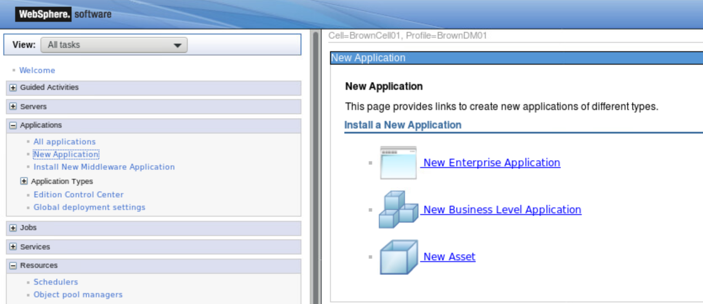
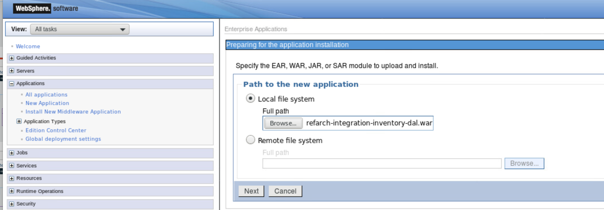
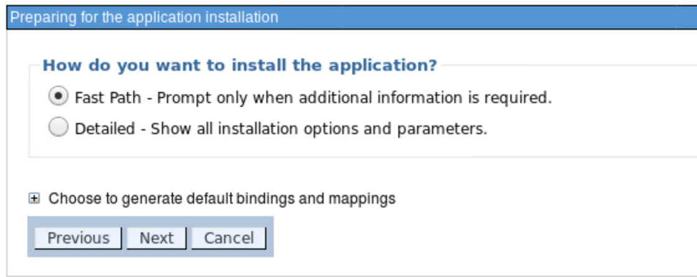
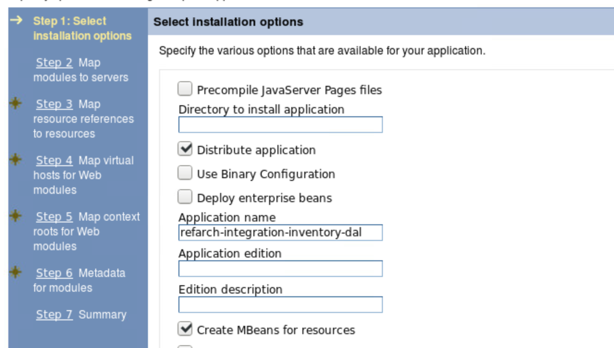
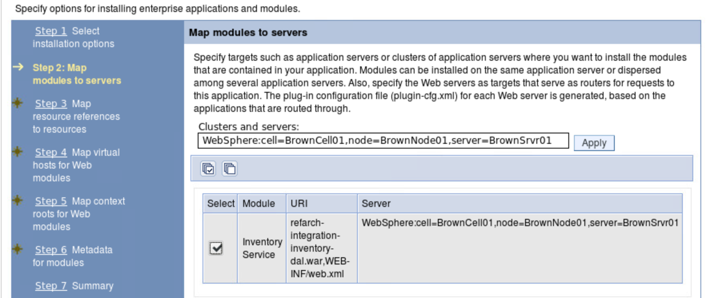
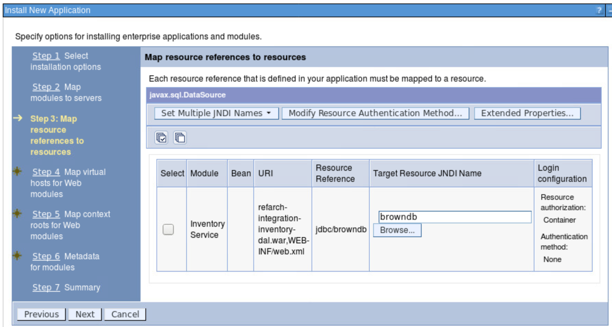
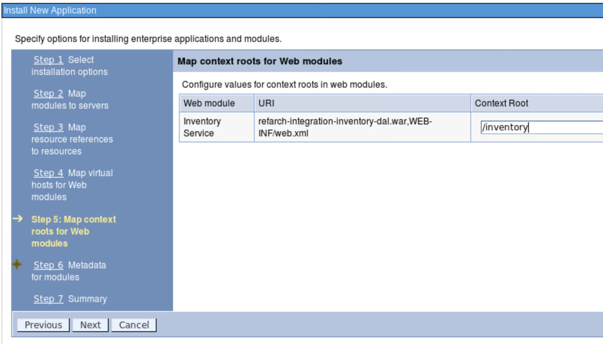

# Deploy to WebSphere Application server
When deploying the war file to

1. Click on Application -> New Application   
 

1. Select the war file:  
 

1. Use the Fast Path wizard:
 

1. Select the default fo the installation option, may be change the application name:  
 

1. Specify the JNDI resources for the data source the application is using, like a DB2 connection: 
 

1.
 

1.
 
