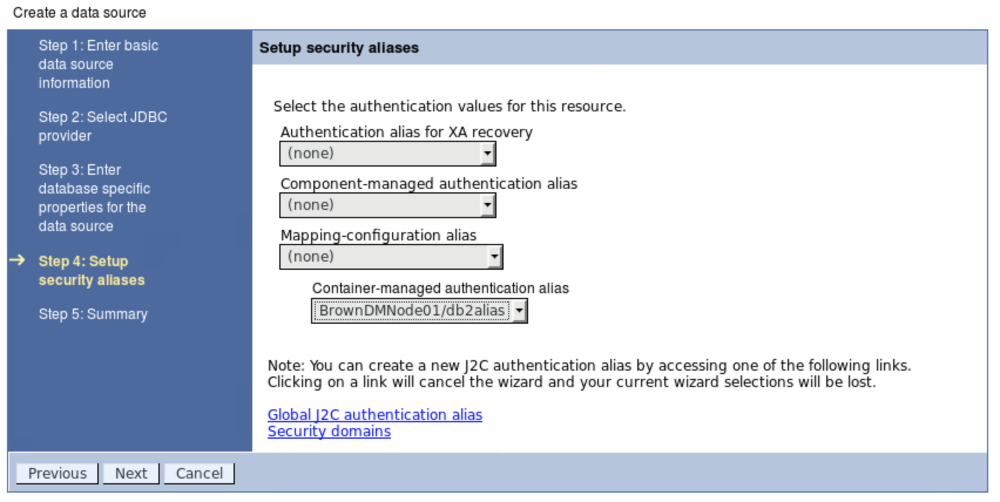

# Deploy to WebSphere Application server
In this note we are explaining the steps we have to do to run this application to WebSphere Application Server 8.5.5. As the application was developed and deployed to Liberty there is some little things to adapt:
* compile the java with 1.6 mode. This is done by changing the two lines in the build.gradle file.
* Ensure the web.xml has servlet declaration with url '/ws' map to the DALservice servlet.  
* Ensure the persistence.xml for JPA is using JNDI resource:
```xml
	  <provider>org.apache.openjpa.persistence.PersistenceProviderImpl</provider>
    <jta-data-source>java:comp/env/jdbc/browndb</jta-data-source>
	  <non-jta-data-source>java:comp/env/jdbc/browndb</non-jta-data-source>

```
* package the war and copy it to the host running WAS. Our server is named brownappserver.

When deploying the war file to WebSphere, you can use the Admin console. The first time you need to declare the JDBC resource. So we copied our licensed DB2 jdbc driver to the 'brownappserver' and then declare the resources:

## Defining database resources

The DB2 is running on remote server. We need to define user authentication and then jdbc data source.
1. For the db2 user go to `Security > Global security > Java Authentication and Authorization Service > J2C authentication data`:
 

1. Enter the userid and password for the DB2 server user:
    

1. To add a data source use the menu: `Resources > JDBC > Data sources`, then specify the JNDI name and data source name:   
   

1. Select an existing Universal JDBC XA provider:
   

1. Enter the database name, the server name or IP address and the port number the DB server listen to:
  

1. Select the security alias defined previously for the DB2 user:  
  

1. Save the configuration and synchronize to the app servers:
 When running with a network deployment topology the configuration are save in the manager node. The configuration needs to be synchronized to the different node agents of the app servers. This is done with the menu: `System Administration -> Nodes > select a node` and `Synchronize` button:
 

## Installing the war

1. Click on `Application -> New Application`   
 

1. Select the war file:  
 

1. Use the Fast Path wizard:
 

1. Select the default fo the installation option, may be change the application name:  
 

1. When using network deployment you may have multiple servers within the cell, the next screen helps to select the target runtime server. Here we select our unique server... yes we are not HA, but this is good for what we want to proof...   
   

1. Specify the JNDI resources for the data source the application is using, like a DB2 connection:
   

1. Specify the application web context, here we use `/inventory`:
 

1. Save your configuration once it is successfully installed.

1. Synchronize configuration

1. Start the Application
 Use the menu: Applications > Application Type > WebSphere enterprise applications, then select the app and `Start` button.
  

1. Wsdl visible at the URL: `http://brownappserver:9080/inventory/ws?wsdl`
  Be sure to have host resolution in your DNS or /etc/hosts.

1. Test access to one record by executing `./scripts/TestGetItem.sh`
